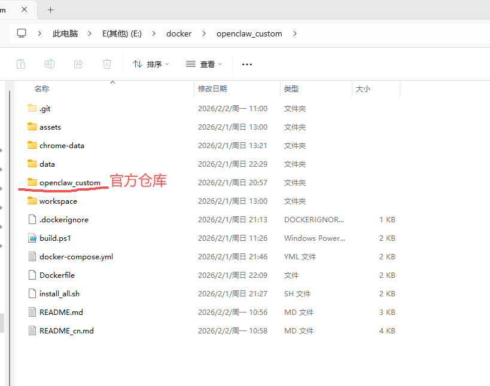

---

### 📄 文件 2：中文版 (README_CN.md)

```markdown
# 🦞 OpenClaw 自定义镜像：无界版 (Limitless Edition)

> **解锁 OpenClaw 的全部潜能：集成 Homebrew、Python AI 全栈环境及动态扩展能力。**
> *打破官方镜像的限制，赋予你的 Agent 运行时安装任何工具的能力。*

[](https://hub.docker.com/r/591124281yj228/openclaw_ready)  

---

## 🧐 为什么要搞这个项目？

### 官方镜像的痛点
出于安全考虑，官方镜像使用非 root 用户 (`USER node`) 运行。这意味着**你无法使用 `apt-get` 安装软件**，也无法在不重新构建整个镜像的情况下临时添加工具。

### 我们的解决方案：无界版
我们通过在镜像中预装 **Homebrew (Linuxbrew)** 解决了这个问题。这使得以 `node` 用户运行的 Agent 无需 root 权限，即可将软件包安装到自己的主目录中。

---

## 📂 项目结构说明 (重要!)

请务必参照下图 (`01.png`) 确认您的目录结构。

**我们的自定义环境文件位于【项目根目录】，而 OpenClaw 官方源码则位于名为 `openclaw_custom` 的子文件夹中。**



### 详细目录层级

```text
.
├── 01.png                  <-- 项目截图
├── README.md               <-- 英文说明
├── README_CN.md            <-- 本文件
│
├── ⭐ docker-compose.yml   <-- [自定义] 主启动文件 (在此处运行命令)
├── ⭐ install_all.sh       <-- [自定义] 扩展脚本
├── ⭐ Dockerfile           <-- [自定义] 增强版构建文件
│
├── 📁 openclaw_custom/     <-- [官方] 源代码子目录
│   ├── src/
│   ├── package.json
│   └── ...
│
├── 📁 data/                <-- [自动生成] 数据持久化目录
├── 📁 workspace/           <-- [自动生成] Agent 工作区
└── 📁 chrome-data/         <-- [自动生成] 浏览器缓存目录